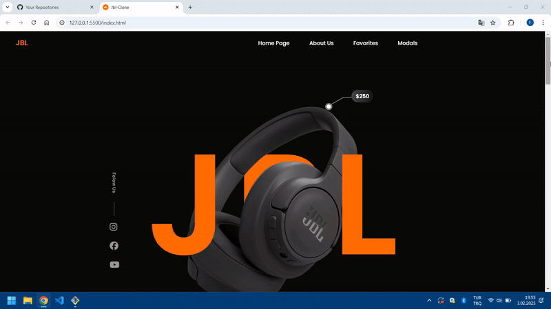

<h1>Jbl-Clone</h1>

Bu proje, responsive tasarım prensiplerine göre oluşturulmuş ve SCSS kullanılarak geliştirilmiş bir web sitesi tasarımıdır. Kullanıcı dostu ve şık bir arayüz sunmayı hedefleyen bu projede, mobil cihazlardan masaüstüne kadar tüm ekran boyutlarına uyum sağlayan bir tasarım yapılmıştır.

<h2>Teknolojiler</h2>

SCSS: Stil sayfalarının yazılmasında SCSS kullanıldı.

HTML5: Yapılandırma için HTML5 kullanıldı.

CSS3: Tarayıcı uyumluluğu için CSS3 özellikleri kullanıldı.

Responsive Design: Mobil uyumlu ve duyarlı bir tasarım oluşturuldu.

<h2>Ekran Görüntüsü</h2>

